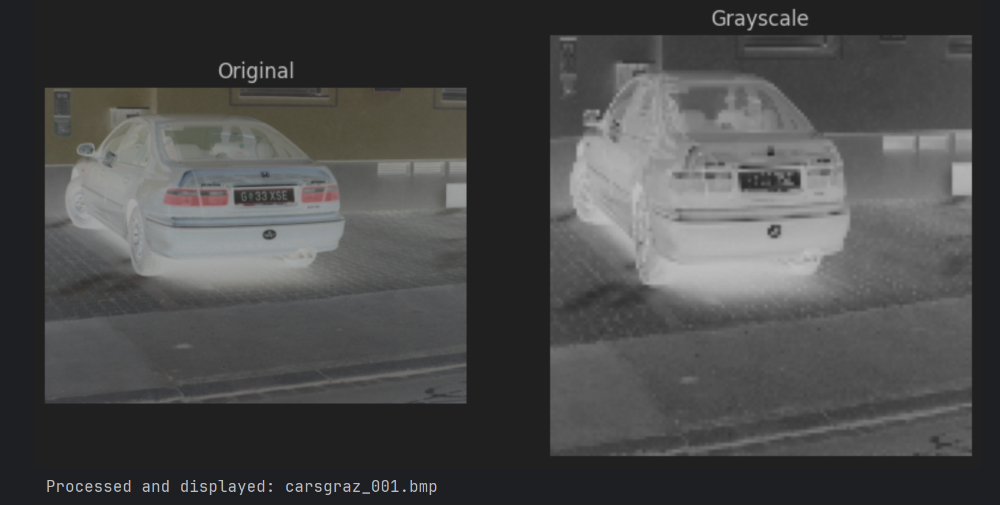
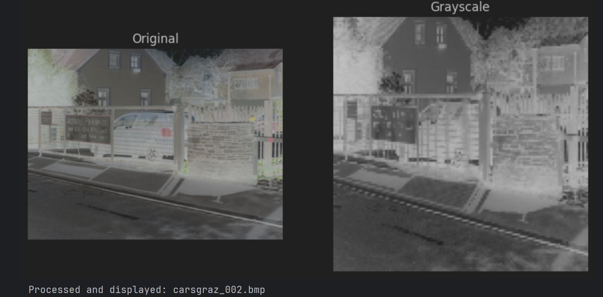
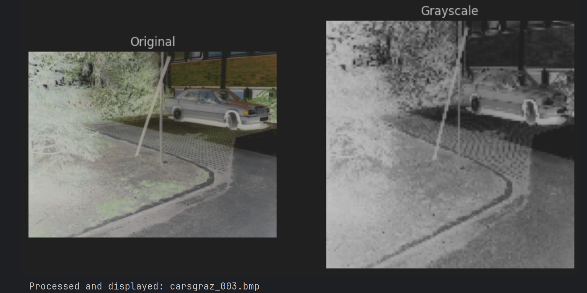
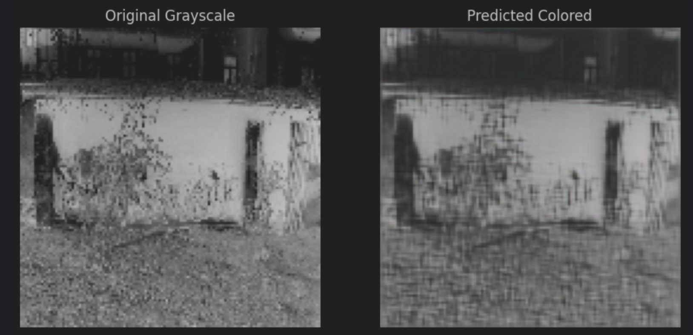
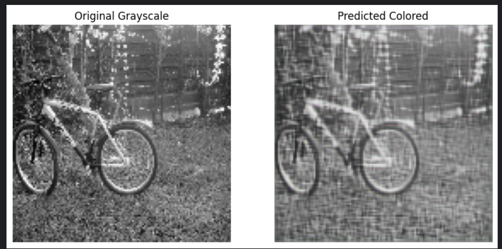
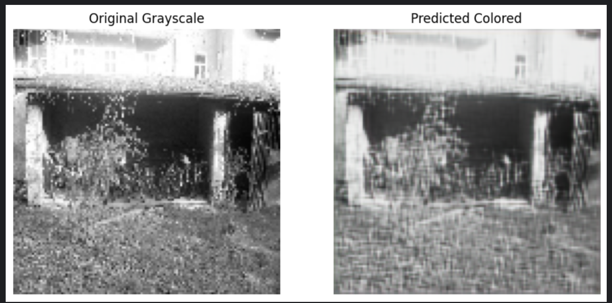
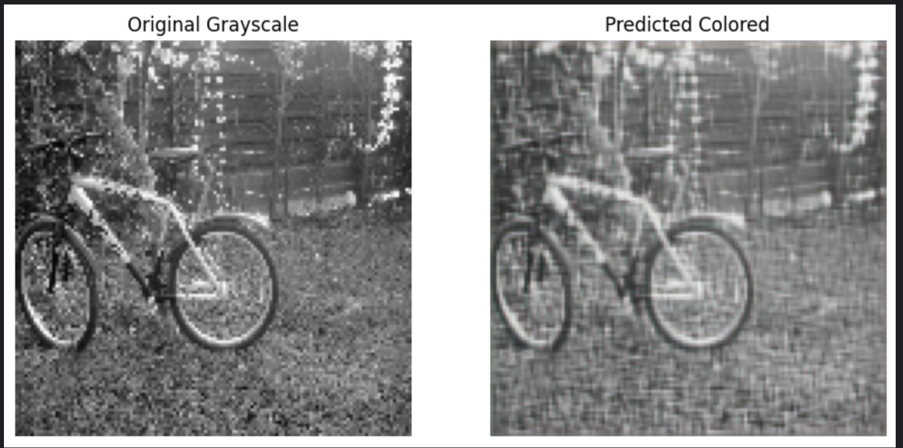

# AutoEncoder
This repository contains an implementation of an AutoEncoder for image data. AutoEncoders are a type of neural network used for unsupervised learning, particularly in image compression, noise reduction, and anomaly detection.

## Dataset
The dataset used in this project can be downloaded from Kaggle: Images Dataset (https://www.kaggle.com/datasets/pavansanagapati/images-dataset)

## Features
- Downloads image dataset from Kaggle
- Preprocesses images for training
- Implements an AutoEncoder using TensorFlow/Keras
- Visualizes encoded and reconstructed images
- Evaluates the model performance

## Requirements
- Python 3.x
- TensorFlow/Keras
- NumPy
- Matplotlib
- Kaggle API (for dataset download)

## 📌 Screenshots

